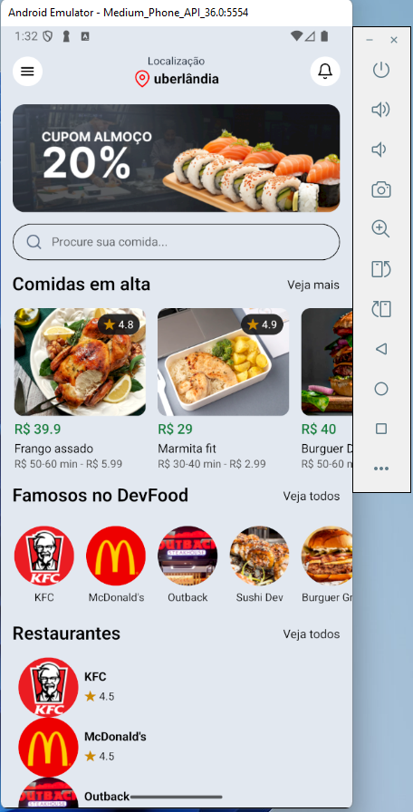

# 🍔 Food Delivery App

Bem-vindo ao **Food Delivery App**! 🚀  
Um aplicativo de delivery de comida feito com [Expo](https://expo.dev), React Native, NativeWind e TypeScript.

<div align="left">
  
</div>

## 📱 Sobre o Projeto

Este projeto é um app de delivery de comida, com listagem de restaurantes, comidas em alta e busca.  
Utiliza rotas baseadas em arquivos, estilização com Tailwind via NativeWind e um backend fake com JSON Server.

## 🛠️ Tecnologias Utilizadas

- [Expo](https://expo.dev/)
- [React Native](https://reactnative.dev/)
- [TypeScript](https://www.typescriptlang.org/)
- [NativeWind (Tailwind CSS)](https://www.nativewind.dev/)
- [Expo Router](https://expo.github.io/router/)
- [JSON Server](https://github.com/typicode/json-server)
- [React Native Pager View](https://github.com/callstack/react-native-pager-view)
- [Expo Vector Icons](https://docs.expo.dev/guides/icons/)

## 🚀 Instalação

1. **Clone o repositório**
   ```sh
   git clone https://github.com/marcionavarro/reactnativetube
   cd food
   ```

2. **Instale as dependências**
   ```sh
   npm install
   ```

3. **Inicie o backend fake**
   ```sh
   npx json-server --watch db.json --port 3000
   ```

4. **Inicie o app**
   ```sh
   npx expo start
   ```

5. **Abra no seu emulador ou dispositivo físico**   
   Se as imagens não carregarem, abra o cmd e digite ipconfig, pegue o
   Endereço IPv4 e coloque no lugar de localhost.   
   Siga as instruções do Expo para rodar no Android, iOS ou Web.

## 📂 Estrutura do Projeto

```
├── src/
│   ├── app/                # Rotas e telas principais
│   ├── components/         # Componentes reutilizáveis
│   ├── styles/             # Estilos globais (Tailwind)
│   └── assets/             # Imagens e fontes
├── db.json                 # Banco de dados fake (JSON Server)
├── package.json
└── ...
```


Feito com 💚 por [Marcio Navarro](https://marcionavarro.com.br)
