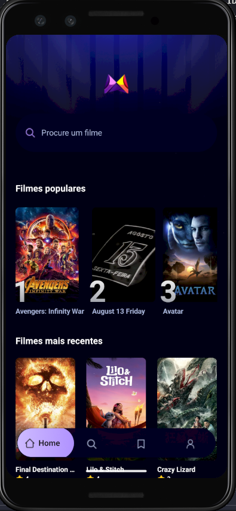

# 🎬 Filmes Flix

Bem-vindo ao **Filmes Flix**, um aplicativo mobile desenvolvido em React Native com Expo, que permite pesquisar, visualizar detalhes e acompanhar tendências de filmes populares!

---

## 🚀 Tecnologias Utilizadas

- **[Expo](https://expo.dev/)**: Plataforma para desenvolvimento rápido de apps React Native.
- **[React Native](https://reactnative.dev/)**: Framework para apps nativos usando React.
- **[TypeScript](https://www.typescriptlang.org/)**: Tipagem estática para maior segurança.
- **[NativeWind](https://www.nativewind.dev/)**: Utilitários Tailwind CSS para React Native.
- **[Appwrite](https://appwrite.io/)**: Backend para salvar e consultar tendências de busca.
- **[The Movie Database API (TMDB)](https://www.themoviedb.org/documentation/api)**: Fonte dos dados dos filmes.

---

## 🛠️ Instalação

1. **Clone o repositório**
   ```sh
   git clone https://github.com/marcionavarro/reactnativetube.git
   cd mobile_movie_app
   ```

2. **Instale as dependências**
   ```sh
   npm install
   ```

3. **Configure as variáveis de ambiente**
   - Crie um arquivo `.env.local` na raiz com as seguintes variáveis:
     ```
     EXPO_PUBLIC_MOVIE_API_KEY=SEU_TOKEN_TMDB
     EXPO_PUBLIC_APPWRITE_PROJECT_ID=SEU_PROJECT_ID
     EXPO_PUBLIC_APPWRITE_DATABASE_ID=SEU_DATABASE_ID
     EXPO_PUBLIC_APPWRITE_COLLECTION_ID=SEU_COLLECTION_ID
     ```

4. **Inicie o projeto**
   ```sh
   npx expo start
   ```

---

## 📱 Funcionalidades

- Pesquisa de filmes por nome.
- Visualização de detalhes completos dos filmes.
- Listagem dos filmes mais populares e recentes.
- Tendências baseadas nas buscas dos usuários.
- Interface moderna e responsiva.

---

## 🖼️ Screenshots

<table>
  <tr>
    <td align="center">Home</td>
    <td align="center">Pesquisa</td>
    <td align="center">Detalhes do Filme</td>
  </tr>
  <tr>
    <td></td>
    <td></td>
    <td></td>
  </tr>
</table>


## 🙏 Créditos

Feito com ❤️ por [Marcio Navarro](https://www.marcionavarro.com.br).  
Este projeto foi inspirado e desenvolvido com base no tutorial do canal [JavaScript Mastery](https://www.youtube.com/watch?v=f8Z9JyB2EIE).

---
